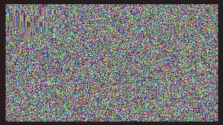

PixelLock 🔐
PixelLock is a powerful and user-friendly tool designed for the secure encryption and decryption of digital images. In an age of increasing concern over data privacy, PixelLock provides a robust solution to protect sensitive visual information using the Advanced Encryption Standard (AES).

✨ Features
Strong Encryption: Implements AES-128 bit encryption from scratch to ensure your images are secure.
Data Integrity: Uses SHA-256 hashing to verify that your files have not been tampered with.
Targeted Encryption: Specifically designed for BMP images, encrypting only the pixel data while leaving the 54-byte header untouched. This prevents file corruption and allows the encrypted image to be structurally valid.
Command-Line Interface: An easy-to-use CLI for quick encryption and decryption tasks.
Performance Optimized: Built to handle large image files efficiently.

⚙️ How It Works
The encryption process is carefully designed to be both secure and reversible without corrupting the image file format.
Read Image: The tool reads the input BMP image.
Separate Data: It separates the 54-byte header from the raw pixel data.
Encrypt Pixels: The pixel data is then encrypted block-by-block using the AES algorithm.
Recombine: The original, untouched header is re-attached to the newly encrypted pixel data.
Save Image: The final result is saved as a new BMP file. The image will appear as visual noise, completely unintelligible without the correct key.
Decryption is the exact reverse of this process, restoring the image to its original state.

Visual Example

Original Image 

Encrypted Image

 

🚀 Getting Started
Prerequisites
Ensure you have a C compiler, such as GCC, installed on your system.
Compilation
Clone the repository:
git clone [https://github.com/AyushiSingh-1/PixelLock.git](https://github.com/AyushiSingh-1/PixelLock.git)
Navigate to the project directory:
cd PixelLock
Compile the C code (assuming the file is named pixellock.c):
gcc pixellock.c -o pixellock

Usage
Before running, you may want to modify the main() function in the pixellock.c source file to specify your input file, output files, and encryption key.

int main() {
    uint8_t key[16] = "ThisIsAKey123..."; // Change your key here
    const char *inputImage = "original.bmp";  // Change to your input file
    const char *encryptedImage = "encrypted_image.bmp";
    const char *decryptedImage = "decrypted_image.bmp";

    printf("Encrypting the image...\n");
    encryptImageData(inputImage, encryptedImage, key);

    printf("Decrypting the image...\n");
    decryptImageData(encryptedImage, decryptedImage, key);

    printf("Done! Check the files.\n");
    return 0;
}

After compiling, run the executable from your terminal:
./pixellock

The program will then perform the encryption and decryption as specified in the main function.

⚠️ Limitations
File Format: Currently, PixelLock only supports the BMP image format due to its fixed header structure.
Cipher Mode: The current implementation uses AES in ECB (Electronic Codebook) mode. While effective, it can show patterns in very uniform images.

🔮 Future Enhancements
We are actively working on improving PixelLock with new features:

[ ] Support for More Formats: Add support for popular formats like PNG and JPEG.
[ ] Advanced Cipher Modes: Implement more secure modes like CBC (Cipher Block Chaining) or GCM (Galois/Counter Mode).
[ ] Graphical User Interface (GUI): Develop an intuitive GUI for users who are not comfortable with the command line.

🤝 Contributing
Contributions are welcome! If you have suggestions or want to improve the code, please feel free to fork the repository, make your changes, and submit a pull request.
